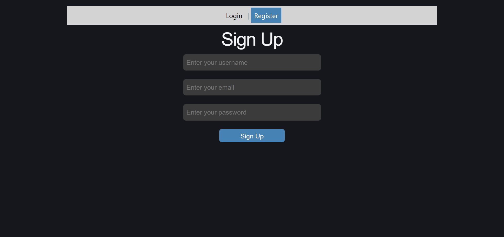
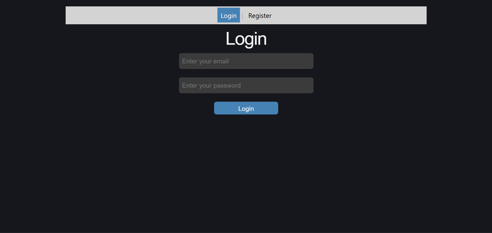

# URL Shortener

A full-stack URL Shortener built using React, FastAPI, and PostgreSQL

## Link
[URL Shortener](https://url-shortener-mayuri9.vercel.app/login)

## Screenshots

## Register

## Login

### Home

### Analytics

## Tech Stack

**Frontend:** React, React Router, JavaScript, CSS

**Backend:** Python, FastAPI

**Database:** PostgreSQL

**Authentication:** bcrypt, JWT

**Testing**: pytest, Vitest

**CI/CD:** GitHub Actions

**Deployment:** Vercel, Render

## Features
- User registration and login
- User specific URL ownership and authorization
- JWT-based authentication
- Generate unique short URLs using Base62-encoded auto-increment IDs
- Store URL mappings in PostgreSQL
- Redirect using FastAPI `RedirectResponse`
- View URL analytics
