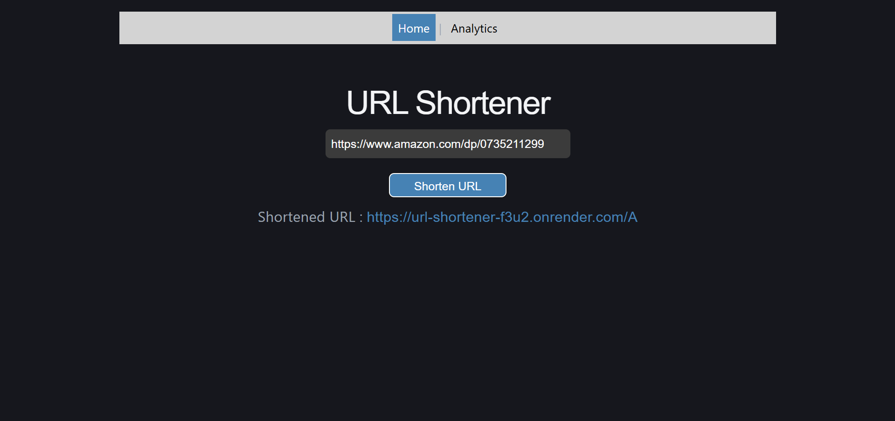
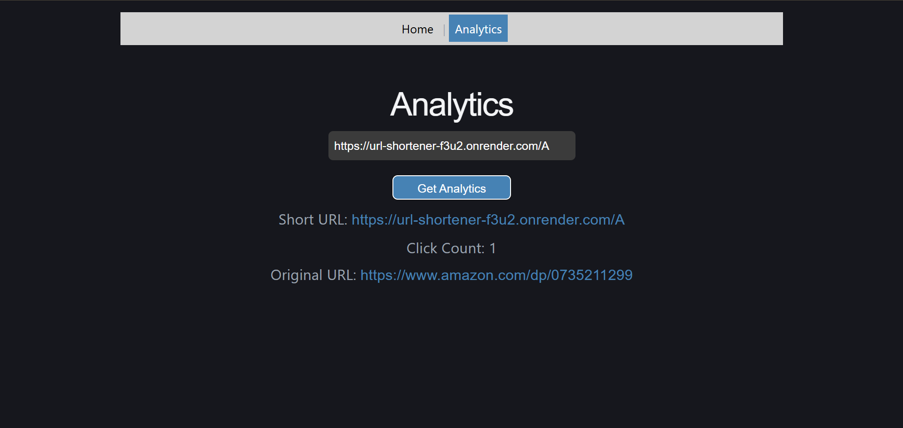

# URL Shortener

A URL Shortener built using React, FastAPI, and PostgreSQL

## Screenshots

### Home

### Analytics

## Tech Stack
- React
- FastAPI
- Python
- PostgreSQL

## Features
- Generate unique short URLs using Base62-encoded auto-increment IDs
- Store URL mappings in PostgreSQL
- Redirect using FastAPI `RedirectResponse`
- View URL analytics